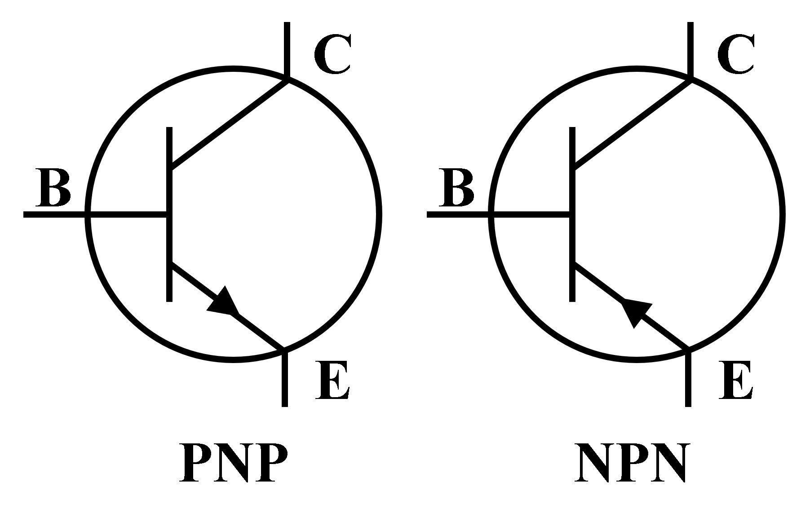
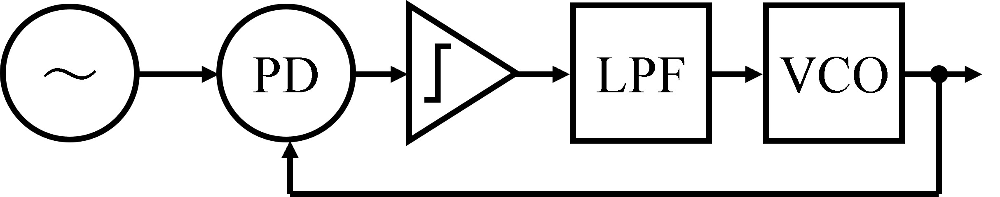
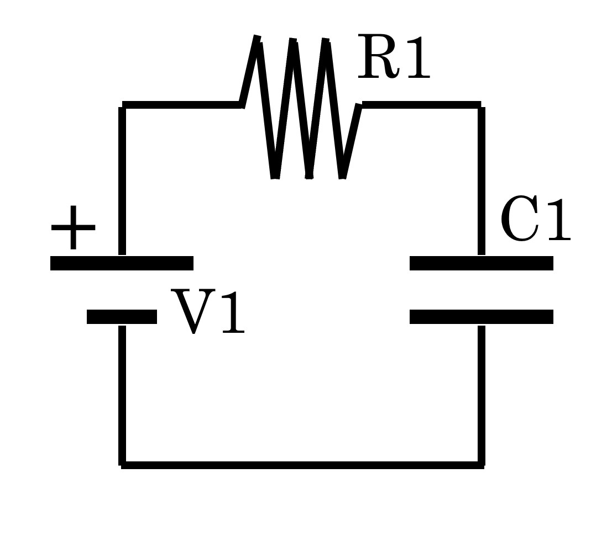

# Electric Components

## 1. Bipolar Junction Transistor (BJT)
<div align="center"></div>

---
---
## 2. Phase-Locked Loop (PLL)
A Phase-Locked Loop (PLL) is a feedback control system that automatically adjusts the phase of a local oscillator to match the phase of an input signal.
It locks the phase of an output signal to a reference signal.

<div align="center"></div>

### 2.1. Phase Detector (PD)
Compare the phase of the input and the VCO output.
 
### 2.2. Low-Pass Filter (LPF)
Filters the output of the PD to remove high-frequency noise.

### 2.3. Voltage-Controlled Oscillator (VCO)
Generates an output whose frequency is controlled by the voltage from the LPF.

### 2.4. Frequency Divider
Implemented in feedback path to allow frequency multiplication or division.

---
---
## 3. Capacitance
```math
{\Large
\begin{aligned}
Z_c &= \dfrac{1}{j \cdot 2\pi \cdot f \cdot C} \\
Z_c &: \rm{Impedance} \\
j &: \rm{Imaginary\ Unit} \\
f &: \rm{Input\ Frequency} \\
C &: \rm{Capacitance\ [F]} \\
\end{aligned}
} 
```

---
---
## 4. Inductance
```math
{\Large
\begin{align}
Z_L &= j \cdot 2\pi \cdot f \cdot L \\
Z_L &: \rm{Impedance} \\
j &: \rm{Imaginary\ Unit} \\
f &: \rm{Input\ Frequency} \\
L &: \rm{Inductance\ [H]} \\
\end{align}
}
```

---
---
## 5. Low-Pass RC-Circuit
> ### References
> [1] https://www.mathforengineers.com/transients-in-electrical-circuits/low-pass-RC-response-to-square-wave.html

<div align="center"></div>

### 5.1. Formula
#### 5.1.1. Use Kirchhoff's Law
```math
{\Large
\begin{align}
V1(t) - V_{R1}(t) - V_{C1}(t) = 0 \cdots (1) \\
\end{align}
}
```

#### 5.1.2. Use Ohm's Law
```math
{\Large
\begin{align}
V_{R1}(t) =  R1 \cdot I(t) \cdots (2) \\
V_{C1}(t) = \dfrac{1}{C1} \int I(t) dt \cdots (3) \\
\end{align}
}
```

#### 5.1.3. Take derivative of Eq.(3)
```math
{\Large
\begin{align}
\dfrac{dV_{C1}(t)}{dt} &=& \dfrac{I(t)}{C1} \cdots (4)\\
I(t) &=& C1 \cdot \dfrac{dV_{C1}(t)}{dt} \cdots (5) \\
\end{align}
}
```

#### 5.1.4. Substitude Eq.(5) into Eq.(2)
```math
{\Large
\begin{align}
V_{R1}(t) = R1 \cdot C1 \cdot \dfrac{dV_{C1}(t)}{dt} \cdots (6) \\
\end{align}
}
```

#### 5.1.5. Substitude Eq.(6) into Eq.(1)
```math
{\Large
\begin{align}
V1(t) - R1 \cdot C1 \cdot \dfrac{dV_{C1}(t)}{dt} - V_{C1}(t) = 0 \cdots (7)
\end{align}
}
```

#### 5.1.6. Take the Laplace Transform of Eq.(7)
```math
{\Large
\begin{align}
\mathcal{L} \left \{ V1(t) - R1 \cdot C1 \cdot \dfrac{dV_{C1}(t)}{dt} - V_{C1}(t) \right \} &=& \mathcal{L} \left ( 0 \right ) \cdots (8) \\
\mathcal{L} \left \{ V1(t) \right \} - R1 \cdot C1 \cdot \mathcal{L} \left \{ \dfrac{dV_{C1}(t)}{dt} \right \} - \mathcal{L} \left \{ V_{C1}(t) \right \} &=& 0 \cdots (9) \\
\end{align}
}
```
```math
{\Large
\begin{align}
\mathcal{L} \left \{ V1(t) \right \} &=& \int ^{\infty}_{0} 2.5 \cdot e^{-st} dt \ \ \left ( V1(t) =
\begin{cases}
0.0 & | & t \lt 0 \\[2mm]
2.5 & | & t \ge 0
\end{cases} \right ) \\
&=& 2.5 \int ^{\infty}_{0} e^{-st} dt \\
&=& 2.5 \left [ - \dfrac{1}{s} e^{-st}\right ] ^{\infty}_{0} \\
&=& \dfrac{2.5}{s} \ \ \left ( s \gt 0 \right ) \cdots (10) \\
\mathcal{L} \left \{ \dfrac{dV_{C1}(t)}{dt} \right \} &=& \int ^{\infty} _{0} e^{-st} \cdot \dfrac{dV_{C1}(t)}{dt} dt \\
&=& \left [ e^{-st} \cdot V_{C1}(t) \right ] ^{\infty} _{0} + s \int ^{\infty} _{0} e^{-st} \cdot V_{C1}(t) dt \\
&=& \left [ e^{-st} \cdot V_{C1}(t) \right ] ^{\infty} _{0} + s \cdot \mathcal{L} \left \{ V_{C1}(t) \right \} \\
&=& \left \{ e^{- s \cdot \infty} \cdot V_{C1}(\infty) - e^{0} \cdot V_{C1}(0) \right \} + s \cdot \mathcal{L} \left \{ V_{C1}(t) \right \} \\
&=& s \cdot \mathcal{L} \left \{ V_{C1}(t) \right \} \ \ \left ( s \gt 0, \ 0 \le V_{C1}(\infty) \le 2.5, \ V_{C1}(0) = 0 \right ) \cdots (11) \\
\end{align}
}
```

#### 5.1.7. Substitude Eq.(10) and Eq.(11) into Eq.(9)
```math
{\Large
\begin{align}
\dfrac{2.5}{s} - R1 \cdot C1 \cdot s \cdot \mathcal{L} \left \{ V_{C1}(t) \right \} - \mathcal{L} \left \{ V_{C1}(t) \right \} &=& 0 \cdots (12) \\
\end{align}
}
```
```math
{\Large
\begin{align}
\mathcal{L} \left \{ V_{C1}(t) \right \} \left ( R1 \cdot C1 \cdot s + 1 \right ) &=& \dfrac{2.5}{s} \cdots (13) \\
\mathcal{L} \left \{ V_{C1}(t) \right \} &=& \dfrac{2.5}{s \left ( R1 \cdot C1 \cdot s + 1 \right )} \\
&=& \dfrac{2.5}{s} - \dfrac{2.5 \cdot R1 \cdot C1}{R1 \cdot C1 \cdot s + 1} \\
&=& \dfrac{2.5}{s} - \dfrac{2.5}{s + \dfrac{1}{R1 \cdot C1}} \cdots (14) \\
\end{align}
}
```

#### 5.1.8. Take Inverse Laplace Transform
```math
{\Large
\begin{align}
V_{C1} &=& \mathcal{L} ^{-1} \left \{ \dfrac{2.5}{s} \right \} - \mathcal{L} ^{-1} \left \{ \dfrac{2.5}{s + \dfrac{1}{R1 \cdot C1}} \right \} \cdots (15) \\
\end{align}
}
```
```math
{\Large
\begin{align}
\mathcal{L} ^{-1} \left \{ \dfrac{2.5}{s} \right \} &=& V1(t) \cdots (16) \\
\mathcal{L} \left \{ e^{-at} \right \} &=& \int ^{\infty}_{0} e^{-at} e^{-st} dt \\
&=& \int ^{\infty}_{0} e^{-(s+a)t} dt \\
&=& -\dfrac{1}{s + a} [ e^{-(s+a)t} ]^{\infty}_{0} \\
&=& \dfrac{1}{s + a} \ \ (s + a \gt 0) \cdots (17) \\
\mathcal{L} ^{-1} \left \{ \dfrac{2.5}{s + \dfrac{1}{R1 \cdot C1}} \right \} &=& V1(t) \cdot e^{-\dfrac{1}{R1 \cdot C1}} \cdots (18) \\
\end{align}
}
```
```math
{\Large
\begin{align}
V_{C1} &=& V1(t) - V1(t) \cdot e^{-\dfrac{1}{R1 \cdot C1}} \\
&=& V1(t) \left ( 1 - e^{- \dfrac{1}{R1 \cdot C1}} \right ) \\
\end{align}
}
```

### 5.2. Simurate with Python
<div align="center"></div>


```
```

