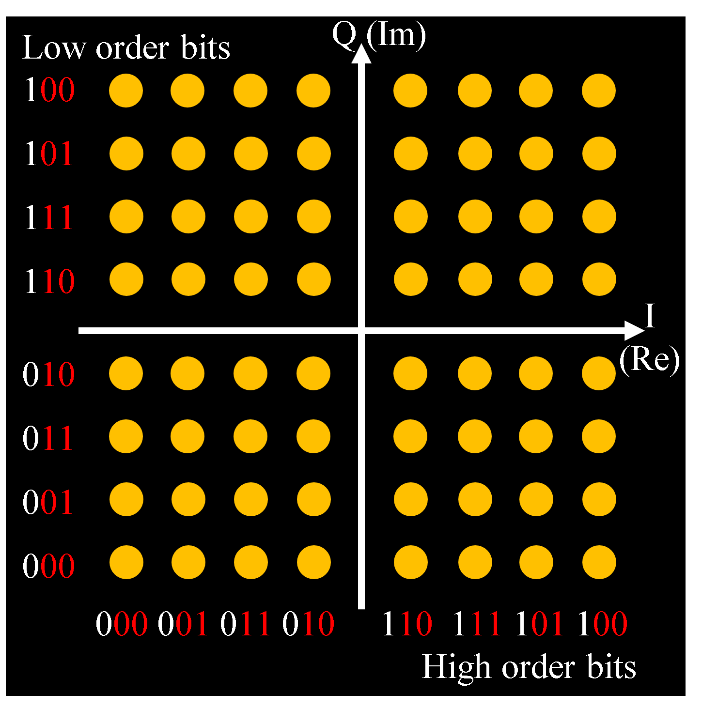
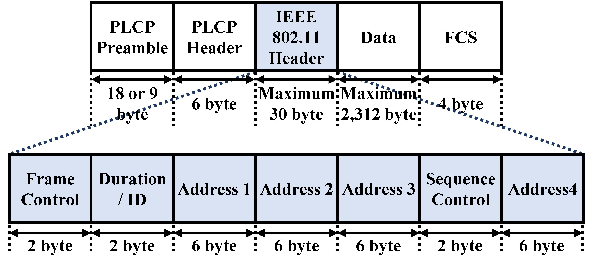

# IEEE 802.11 Standards

## 1. ODFM(Orthogonal Frequency Division Multiplexing)

> ### References
> 1. https://www.mathworks.com/help/wireless-hdl/ug/hdlofdmreceiver.html

### 1.2. Application Examples
- IEEE 802.11a/b/g/n/ac/ax
- Integrated Services Digital Broadcasting - Terrestrial (ISDB-T)
- 4G/5G

### 1.3. Features
- Multicarrier Transmission
  - Data is distributed across multiple subcarriers and transmitted/received.

- Frequency efficiency
  - The carrier spacing can be narrowed, allowing for more efficient use of the bandwidth.

- Fading resistance
  - Resistant to frequency selective fading and multipath distortion.

- High speed transmission
  - By combining with MIMO technology, communication speeds can be increased without increasing frequency bands.

### 1.4. OFDM principle
#### 1.4.1. QAM (Quadrature Amplitude Modulation)

> Normally, when multiple waves of the same frequency are combined, it becomes impossible to extract the original waves.
> However, when waves are exactly 90 degrees out of phase with each other, it becomes possible.

- Map the transmit signal from a bit stream to the complex plane.
  - The data is converted into a combination of wave phase, reference wave amplitude (I) and quadrature wave amplitude (Q).

#### 1.4.2. Modulate with Inverse Fast Fourier Transform (IFFT)
- The signal mapped to the complex plane is converted to a time domain signal.

#### 1.4.3. D/A convert and up-convert to the desired frequency

#### 1.4.4. Demodulation at the Receiving End
- The original signal is restored by performing A/D conversion
- Fast Fourier Transform (FFT), and decoding to a bit stream.

## 2. Frame Format of 802.11n

### 2.1. PLCP (Physical Layer Convergence Protocol) Preamble
- This section contains synchronization bits added by the physical layer

### 2.2. PLCP (Physical Layer Convergence Protocol) Header
- This section contains following information added by the physical layer
  - Modulation method
  - Transmission speed
  - Data length

### 2.3. IEEE 802.11 Header
- This section contains some information added by the data link layer

#### 2.3.1. Frame Control
- This section contains following informations.
  - Frame type
    - Management Frame (00)
    - Control Frame (01)
    - Data Frame (10)
  - Frame destination 
  - A flag whether the sender is Wired or Wireless
  - Flagment information
  - Power control
  - A flag whether the WEP is enabled or not

#### 2.3.2. Duration / ID
- This section contains a expected time required for frame transmission used by RTS (Request to Send) / CTS (Clear to Send).

#### 2.3.3. Address1, 2, 3
- This sections contain the information such as destination MAC address, source MAC Address and access point MAC address (BSSID).

#### 2.3.4. Sequence Control
- This section contains the information on the sequence number of the data or the flagment number.

#### 2.3.5. Address4
- This section contains the information such as destination MAC address, source MAC Address and access point MAC address (BSSID).

### 2.A. Appendix
- The IEEE 802.11 Header section, the Data section and the FCS section are collectively called PSDU (PLCP Service Data Unit).

## 3. IEEE 802.11n (Wi-Fi4)
### 3.1. Specification
- Support 2.4 GHz / 5.0 GHz band width.
- Maximum 600 Mbps transmission speed.
  - MIMO (Multi Input Multi Output)
  - Channel Bonding 
  - Frame Aggregation
