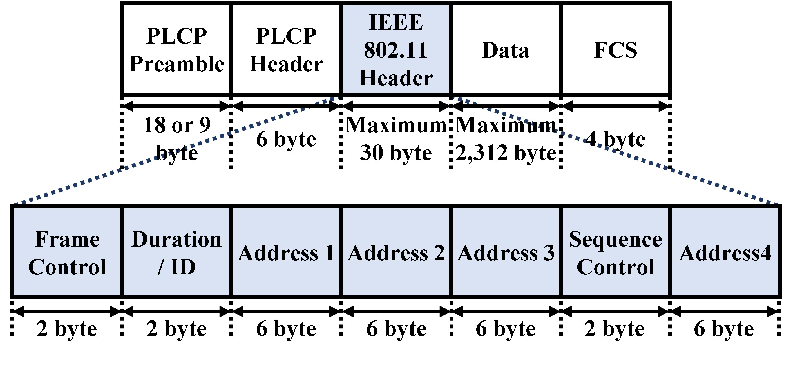

# Frame Format of 802.11n

## 1. PLCP (Physical Layer Convergence Protocol) Preamble

- This section contains synchronization bits added by the physical layer.

## 2. PLCP (Physical Layer Convergence Protocol) Header

- This section contains following information added by the physical layer.
  - Modulation method
  - Transmission speed
  - Data length

## 3. IEEE 802.11 Header

- This section contains some information added by the data link layer.

### 3.1. Frame Control

- This section contains following informations.
  - [Frame type](ieee802.11-frame-type.md) 
  - Frame destination 
  - A flag whether the sender is Wired or Wireless.
  - Flagment information
  - Power control
  - A flag whether the WEP is enabled or not.

### 3.2. Duration / ID

- This section contains a expected time required for frame transmission used by RTS (Request to Send) / CTS (Clear to Send).

### 3.3. Address1, 2, 3

- This sections contain the information such as destination MAC address, source MAC Address and access point MAC address (BSSID).

### 3.4. Sequence Control

- This section contains the information on the sequence number of the data or the flagment number.

### 3.5. Address4

- This section contains the information such as destination MAC address, source MAC Address and access point MAC address (BSSID).
- If it is a management frame, e.g. beacons, this section contains the actual SSID string.

## Appendix

- The IEEE 802.11 Header section, the Data section and the FCS section are collectively called PSDU (PLCP Service Data Unit).

