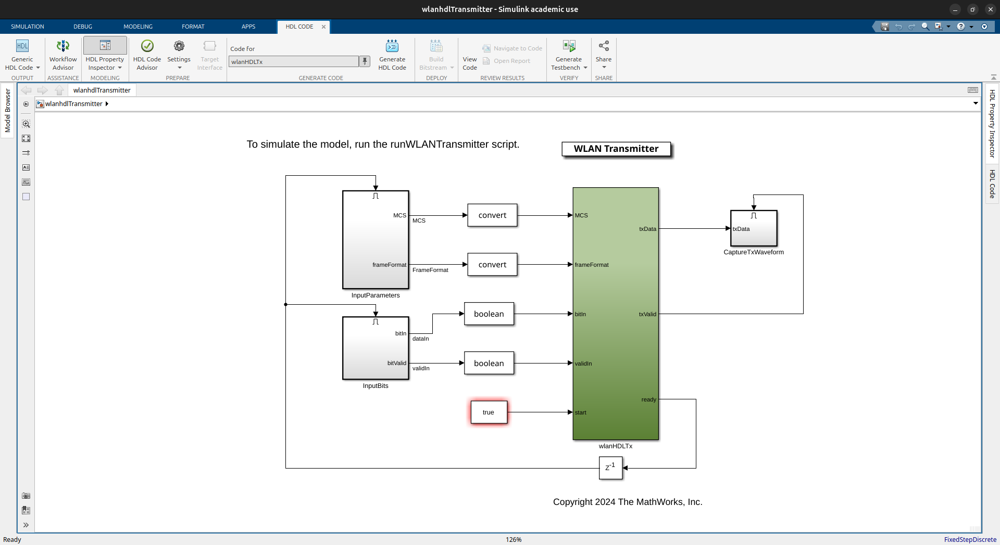

# IEEE 802.11 Project using MATLAB / Simulink

## 1. Import Examples
### 1.1. WLAN HDL Transmitter Example
```
openExample('whdl/WLANHDLTransmitterExample', 'workDir', '~/WLANHDLTransmitter')
```

### 1.2. WLAN HDL Receiver Example
```
openExample('whdl/WLANHDLReceiverExample', 'workDir', '~/WLANHDLReceiver')
```

## 2. Generate HDL Files
### 2.1. Run the Project 


### 2.2. Open Simulink Top-level File


### 2.3. Click `Generate HDL Code`


