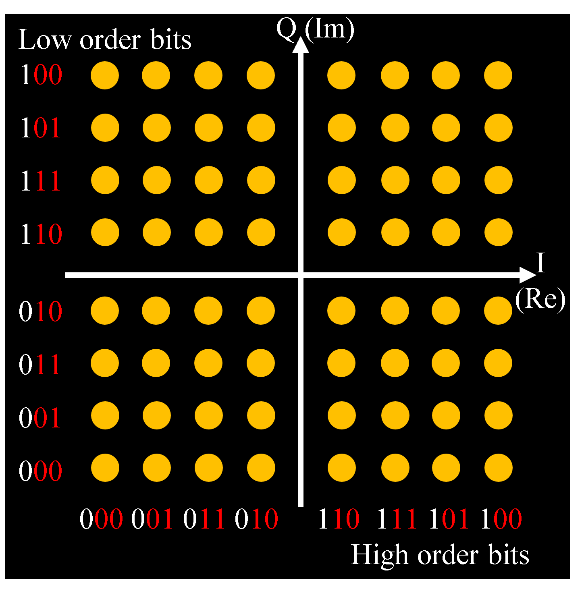

# Orthogonal Frequency Division Multiplexing (OFDM)

## 1. Application Example

- IEEE 802.11a/b/g/n/ac/ax
- Integrated Services Digital Broadcasting - Terrestrial (ISDB-T)
- 4G/5G

## 2. Features

- Multicarrier Transmission
  - Data is distributed across multiple subcarriers and transmitted/received.

- Frequency efficiency
  - The carrier spacing can be narrowed, allowing for more efficient use of the bandwidth.

- Fading resistance
  - Resistant to frequency selective fading and multipath distortion.

- High speed transmission
  - By combining with MIMO technology, communication speeds can be increased without increasing frequency bands.

## 3. OFDM principle

### 3.1. QAM (Quadrature Amplitude Modulation)

> Normally, when multiple waves of the same frequency are combined, it becomes impossible to extract the original waves.
> However, when waves are exactly 90 degrees out of phase with each other, it becomes possible.

- Map the transmit signal from a bit stream to the complex plane.
  - The data is converted into a combination of wave phase, reference wave amplitude (I) and quadrature wave amplitude (Q).

</img>

### 3.2. Modulate with Inverse Fast Fourier Transform (IFFT)

- The signal mapped to the complex plane is converted to a time domain signal.

### 3.3. D/A convert and up-convert to the desired frequency

### 3.4. Demodulation at the receiving end

- The original signal is restored by performing A/D conversion
- Fast Fourier Transform (FFT), and decoding to a bit stream.

## References

1. https://www.mathworks.com/help/wireless-hdl/ug/hdlofdmreceiver.html

