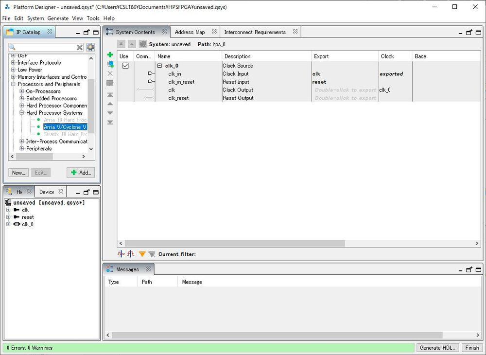
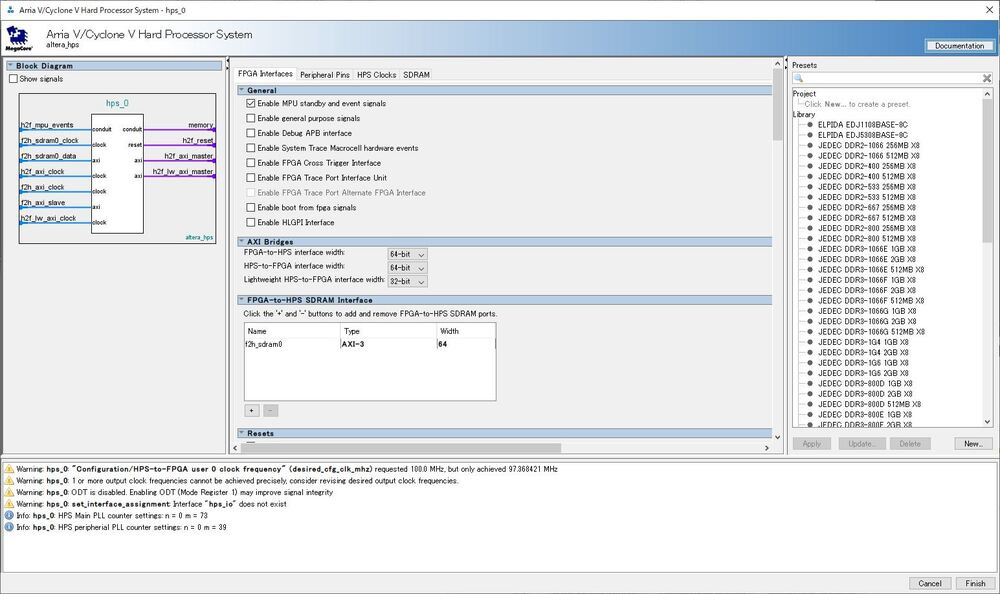
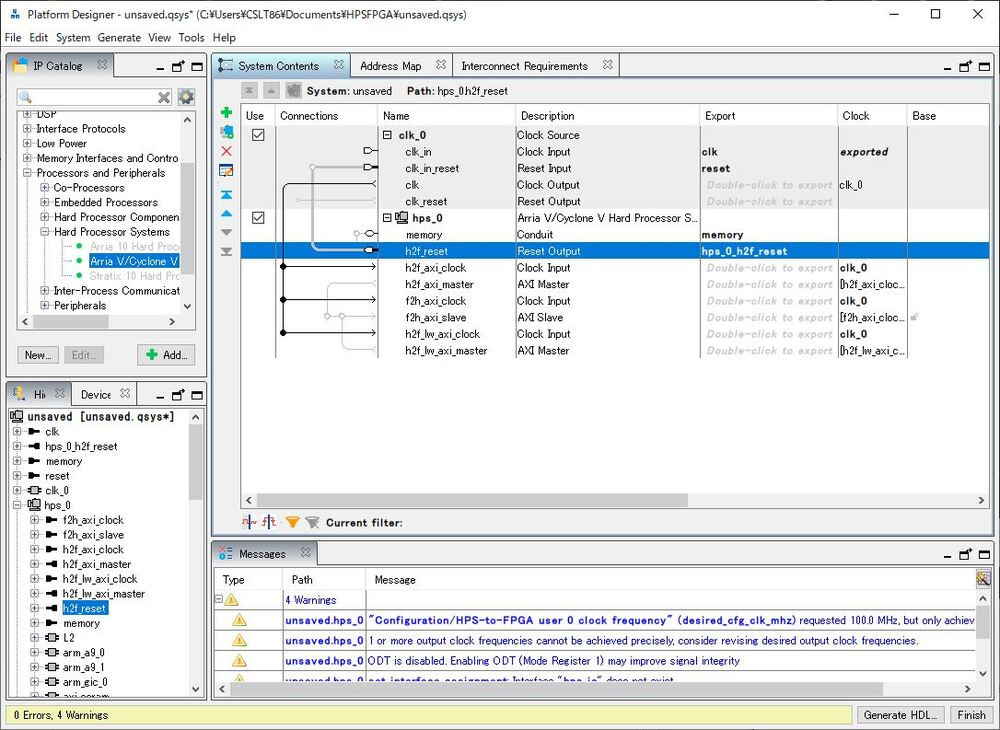
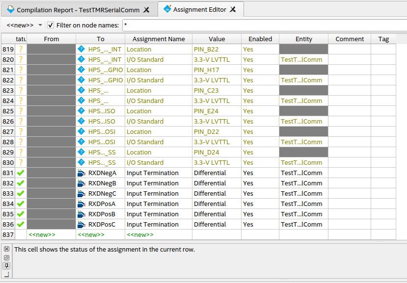

# Use Intel FPGA with Quartus and ModelSim

## 1. Initial Configuration
### 1.1. Configure udev for USB Blaster
```
sudo vim /etc/udev/rules.d/51-usbblaster.rules
```
```
SUBSYSTEM=="usb", ATTR{idVendor}=="09fb", ATTR{idProduct}=="6001", MODE="0666"
SUBSYSTEM=="usb", ATTR{idVendor}=="09fb", ATTR{idProduct}=="6002", MODE="0666"
SUBSYSTEM=="usb", ATTR{idVendor}=="09fb", ATTR{idProduct}=="6003", MODE="0666"
SUBSYSTEM=="usb", ATTR{idVendor}=="09fb", ATTR{idProduct}=="6010", MODE="0666"
SUBSYSTEM=="usb", ATTR{idVendor}=="09fb", ATTR{idProduct}=="6810", MODE="0666"
```
> ### References
> - https://www.intel.co.jp/content/www/jp/ja/support/programmable/support-resources/download/dri-usb-b-lnx.html

### 1.2. Install Packages for ModelSim
```
sudo dpkg --add-architecture i386
```
```
sudo apt update
```
```
sudo apt install libxft2:i386 libxtst6:i386
```

---
## 2. HPS and FPGA Co-Design
### 2.1. Get Ubuntu Image for Intel DE1-SoC FPGA
- https://www.terasic.com.tw/cgi-bin/page/archive.pl?Language=English&No=836&PartNo=4

### 2.2. Burn the Image to microSD card
#### 2.2.1. Prepare microSD card
- Prerequisite: You need at least a 8GB microSD card.

#### 2.2.2. Search the microSD card device
```
sudo fdisk -l
```
```
Disk /dev/sdb: 3.64 GiB, 3904897024 bytes, 7626752 sectors
Disk model: Storage Device
Units: sectors of 1 * 512 = 512 bytes
Sector size (logical/physical): 512 bytes / 512 bytes
I/O size (minimum/optimal): 512 bytes / 512 bytes
Disklabel type: dos
Disk identifier: 0x000e90f2
```

#### 2.2.3. Format the microSD card
```
sudo parted /dev/sdb
```
```
(parted) mklabel gpt
```

#### 2.2.4. Burn the disk image to the microSD card
```
ff if=<Downloaded Disk Image Path> of=/dev/sdb status=progress && sync
```

### 2.3. Run Linux
#### 2.3.1. Prepare FPGA
- Insert the microSD card to FPGA
- Set MSEL on your DE1-SoC to 000000.

#### 2.3.2. (Optional) Specify MAC Address
```
setenv ethaddr <Addr>
saveenv
reset
```

#### 2.3.3. (Optional) Resize root partition
```
parted
print all
resizepart 2
exit
df -H
resize2fs /dev/mmcblk0p2
```

### 2.4. Create HPS Configurations
#### 2.4.1. Open `Qsys` or `Platform Designer`
<div align="center"></div>

#### 2.4.2. Add `Hard Processor Systems` > `Cyclone V`
<div align="center"></div>

- Select `Disable MPU standby and event signals`.
- Delete `FPGA-HPS SDRAM Interface`

#### 2.4.3. Configure the Bridge by Clicking the Junction
<div align="center"></div>

- Export `h2f_reset` of `hps_0`

#### 2.4.4. Create HPS and FPGA Connection
<div align="center"></div>

- Add `PIO (Parallel I/O)`
- Configure Parameters on Peripheral Pins
  - Ethernet Media Access Controller
    - EMAC1 pin: HPS I/O Set 0
    - EMAC1 mode: RGMII
  - SD/MMC Controller
    - SDIO pin: HPS I/O Set 0
    - SDIO mode: 4-bit Data
  - USB Controllers
    - USB1 pin: HPS I/O Set 0
    - USB1 PHY interface mode: SDR with PHY clock output mode
  - UART Controllers
    - UART0 pin: HPS I/O Set 0
    - UART0 mode: No Flow Control
- Configure Parameters on SDRAM
  - PHY Settings
    - Clocks
      - Memory clock frequency: 400 MHz
      - PLL reference clock frequency: 25 MHz
  - Memory Parameters
    - Memory device speed grade: 800.0 MHz
    - Total interface width: 32
    - Row adress width: 15
    - Column address width: 10
    - Memory Initialization Options
      - Memory CAS latency setting: 11
      - Output drive strength setting; RZQ/7
      - ODT Rit normal value: RZQ/4
      - Memory write CAS latency setting: 8
  - Memory Timing
    - tIS (base): 180 ps
    - tIH (base): 140 ps
    - tDS (base): 30 ps
    - tDH (base): 65 ps
    - tDQSQ: 125 ps
    - tQH: 0.38 cycles
    - tDQSCK: 255 ps
    - tDQSS: 0.25 cycles
    - tDQSH: 0.4 cycles
    - tDSH: 0.2 cycles
    - tDSS: 0.2 cycles
    - tINIT: 500 us
    - tMRD: 4 cycles
    - tRAS: 35.0 ns
    - tRCD: 13.75 ns
    - tRP: 13.75 ns
    - tREFI: 7.8 us
    - tRFC: 260 ns
    - tWR: 15.0 ns
    - tWTR: 4 cycles
    - tFAW: 30.0 ns
    - tRRD: 7.5 ns
    - tRTP: 7.5 ns
  - Board Settings
    - Board Skews
      - Maximum CK delay to DIMM/device: 0.03 ns
      - Maximum DQS delay to DIMM/device: 0.02 ns
      - Minimum delay difference between CK and DQS: 0.09 ns
      - Maximum delay difference between CK and DQS: 0.16 ns
      - Maximum skew within DQS group: 0.01 ns
      - Maximum skew between DQS group: 0.08 ns
      - Maximum skew within address and command bus: 0.03 ns

#### 2.4.5. Import HPS Configurations into Quartus Project and Compile the Project
1. Open `qsys` or `Platform Designer`
1. Click `Generate VHDL`
1. Add `.qip` files to the quartus project.
1. Run `Processing` > `Start` > `Start Analysis & Synthesis`.
1. Run TCL Scripts: `Tools` > `TCL Scripts` > `hps_sdram_p0_parameters.tcl`
1. Run TCL Scripts: `Tools` > `TCL Scripts` > `hps_sdram_p0_pin_assignments.tcl`
1. Compile the project
1. `File` > `Convert Programming Files`
1. Set `Programming File Type` to `Raw Binary File (.rbf)`
1. Set `File Name` to `soc_system.rbd`
1. `Input files to convert` > `SoF Data` > `Add File`
1. Copy RBF to U-BOOT partition

> ### References
> - https://www.youtube.com/watch?v=2WUkEt4-Q7Q

### 2.6. HPS Communication with FPGA
```
#include <stdio.h>
#include <stdint.h>
#include <stdlib.h>
#include <string.h>
#include <fcntl.h>
#include <unistd.h>
#include <sys/types.h>
#include <sys/mman.h>
#include "hps_addr.h"

#define ADDR_BASE 0xFF200000
#define ADDR_SPAN 0x00200000
#define BUF_SIZE  256
#define HEX_0     0x40
#define HEX_1     0x79
#define HEX_2     0x24
#define HEX_3     0x30
#define HEX_4     0x19
#define HEX_5     0x12
#define HEX_6     0x02
#define HEX_7     0x78
#define HEX_8     0x00
#define HEX_9     0x10
#define HEX_A     0x08
#define HEX_B     0x03
#define HEX_C     0x46
#define HEX_D     0x21
#define HEX_E     0x06
#define HEX_F     0x0E

extern int   open_phys();
extern void  close_phys();
extern void *map_phys();
extern int   unmap_phys();

struct list {
  uint32_t bin;
  char str[33];
  char hex[8];
  struct list *next;
};
typedef struct list list;
typedef struct timeval timeval;

int getVAddr(int fdsc, void **V_BASE, void **SW, void **HEX0, void **HEX1, void **HEX2, void **HEX3, void **HEX4, void **HEX5){
  if((fdsc = open_phys(fdsc)) == -1){
    return 1;
  }
  if(!(*V_BASE = map_phys(fdsc, ADDR_BASE, ADDR_SPAN))){
    return 1;
  }
  *SW   = (void *)(*V_BASE +   SW_BASE);
  *HEX0 = (void *)(*V_BASE + HEX0_BASE);
  *HEX1 = (void *)(*V_BASE + HEX1_BASE);
  *HEX2 = (void *)(*V_BASE + HEX2_BASE);
  *HEX3 = (void *)(*V_BASE + HEX3_BASE);
  *HEX4 = (void *)(*V_BASE + HEX4_BASE);
  *HEX5 = (void *)(*V_BASE + HEX5_BASE);
  return 0;
}

void setSelect(fd_set *fdsc_slct){
  FD_ZERO(fdsc_slct);
  FD_SET(0, fdsc_slct);
}

int isSameStr(char *str1, char *str2, int len){
  return strncmp(str1, str2, len) == 0;
}

void addNewTest(list **first_test, char *str){
  int i, j, len;
  list *final_test = *first_test;
  if(*first_test == NULL){
    final_test = *first_test = (list *)malloc(sizeof(list));
  }else{
    while(final_test->next != NULL){
      final_test = final_test->next;
    }
    final_test = final_test->next = (list *)malloc(sizeof(list));
  }
  len = strlen(str);
  for(i = 0; i < 32 - len; i++){
    final_test->str[i] = '0';
  }
  for(i = 0; i < len; i++){
    if(str[i] == '0' || str[i] == '1'){
      final_test->str[32 - len + i] = str[i];
    }else{
      final_test->str[32 - len + i] = '0';
    }
  }
  memset(&final_test->bin, 0, 4);
  for(i = 0; i < 32; i++){
    final_test->bin <<= 1;
    if(final_test->str[i] == '1'){
      final_test->bin |= 0x1;
    }
  }
  for(i = 0; i < 4; i++){
    j = 2 * i;
    switch(((char *)(&final_test->bin))[i] & 0xF){
      case  0: final_test->hex[j] = HEX_0; break;
      case  1: final_test->hex[j] = HEX_1; break;
      case  2: final_test->hex[j] = HEX_2; break;
      case  3: final_test->hex[j] = HEX_3; break;
      case  4: final_test->hex[j] = HEX_4; break;
      case  5: final_test->hex[j] = HEX_5; break;
      case  6: final_test->hex[j] = HEX_6; break;
      case  7: final_test->hex[j] = HEX_7; break;
      case  8: final_test->hex[j] = HEX_8; break;
      case  9: final_test->hex[j] = HEX_9; break;
      case 10: final_test->hex[j] = HEX_A; break;
      case 11: final_test->hex[j] = HEX_B; break;
      case 12: final_test->hex[j] = HEX_C; break;
      case 13: final_test->hex[j] = HEX_D; break;
      case 14: final_test->hex[j] = HEX_E; break;
      case 15: final_test->hex[j] = HEX_F; break;
    }
    j = 2 * i + 1;
    switch(((char *)(&final_test->bin))[i] >> 4){
      case  0: final_test->hex[j] = HEX_0; break;
      case  1: final_test->hex[j] = HEX_1; break;
      case  2: final_test->hex[j] = HEX_2; break;
      case  3: final_test->hex[j] = HEX_3; break;
      case  4: final_test->hex[j] = HEX_4; break;
      case  5: final_test->hex[j] = HEX_5; break;
      case  6: final_test->hex[j] = HEX_6; break;
      case  7: final_test->hex[j] = HEX_7; break;
      case  8: final_test->hex[j] = HEX_8; break;
      case  9: final_test->hex[j] = HEX_9; break;
      case 10: final_test->hex[j] = HEX_A; break;
      case 11: final_test->hex[j] = HEX_B; break;
      case 12: final_test->hex[j] = HEX_C; break;
      case 13: final_test->hex[j] = HEX_D; break;
      case 14: final_test->hex[j] = HEX_E; break;
      case 15: final_test->hex[j] = HEX_F; break;
    }
  }
}

int next_test(list **cur_test){
  if((*cur_test)->next == NULL){
    return 1;
  }else{
    *cur_test = (*cur_test)->next;
  }
  return 0;
}

void freeVAddr(void *V_BASE, int fdsc){
  unmap_phys(V_BASE, ADDR_SPAN);
  close_phys(fdsc);
}

int main(int args, char *argv[]){
  void *V_BASE, *SW, *HEX0, *HEX1, *HEX2, *HEX3, *HEX4, *HEX5;
  int fdsc = -1, test_run = 1, slct, len;
  FILE *ftest;
  char buf[BUF_SIZE], exec[BUF_SIZE];
  list *cur_test = NULL;
  fd_set fdsc_slct, fdsc_read;
  timeval timeout = {1, 0};
  setvbuf(stdout, NULL, _IONBF, 0);
  if(getVAddr(fdsc, &V_BASE, &SW, &HEX0, &HEX1, &HEX2, &HEX3, &HEX4, &HEX5)){
    return 1;
  }
  setSelect(&fdsc_slct);
  if(args < 2){
    printf("Input: ");
    buf[read(0, buf, BUF_SIZE) - 1] = '\0';
    addNewTest(&cur_test, buf);
  }else{
    if((ftest = fopen(argv[1], "r")) == NULL){
      printf("Failed to Open the File\n");
      return 1;
    }
    while(fgets(exec, BUF_SIZE, ftest) != NULL){
      len = strlen(exec);
      if(exec[len - 1] == '\n'){
        exec[len - 1] = '\0';
      }
      addNewTest(&cur_test, exec);
    }
    fclose(ftest);
  }
  while(test_run){
    memcpy(&fdsc_read, &fdsc_slct, sizeof(fdsc_slct));
    slct = select(1, &fdsc_read, NULL, NULL, &timeout);
    printf("EXEC: %s\n", cur_test->str);
    if(*(uint32_t *)SW == 0){
      *(char *)HEX0 = cur_test->hex[0];
      *(char *)HEX1 = cur_test->hex[1];
      *(char *)HEX2 = cur_test->hex[2];
      *(char *)HEX3 = cur_test->hex[3];
      *(char *)HEX4 = cur_test->hex[4];
      *(char *)HEX5 = cur_test->hex[5];
    }else{
      *(char *)HEX0 = cur_test->hex[6];
      *(char *)HEX1 = cur_test->hex[7];
      *(char *)HEX2 = HEX_0;
      *(char *)HEX3 = HEX_0;
      *(char *)HEX4 = HEX_0;
      *(char *)HEX5 = HEX_0;
    }
    if(FD_ISSET(0, &fdsc_read)){
      buf[read(0, buf, BUF_SIZE) - 1] = '\0';
      if(isSameStr(buf, "stop", 4)){
        printf("Stopping...\n");
        test_run = 0;
      }else if(isSameStr(buf, "next", 4)){
        if(next_test(&cur_test)){
          printf("Finish!\n");
          test_run = 0;
        }
      }
    }
    usleep(1000000);
  }
  freeVAddr(V_BASE, fdsc);
  return 0;
}
```

## 3. Configure On-Chip Termination
<div align="center"></div>

- By using Assignment Editor, giving constraints of Input Termination to specific input.

## 4. PLL Generation Using Shell Script
```
CLOCK_FREQUENCY="10MHz"

ip-generate \
  --component-name="altera_pll" \
  --system-info=DEVICE_FAMILY="Cyclone V" \
  --system-info=DEVICE="5CSEMA5F31C6" \
  --output-directory="${PWD}" \
  --file-set="QUARTUS_SYNTH" \
  --output-name="GeneratedPLL" \
  --component-param=gui_reference_clock_frequency="50MHz" \
  --component-param=gui_output_clock_frequency0="${CLOCK_FREQUENCY}" \
  --component-param=gui_duty_cycle0="50%" \
  --component-param=gui_phase_shift0="0" \
  --allow-mixed-language-simulation \
  --language="vhdl" 
```
