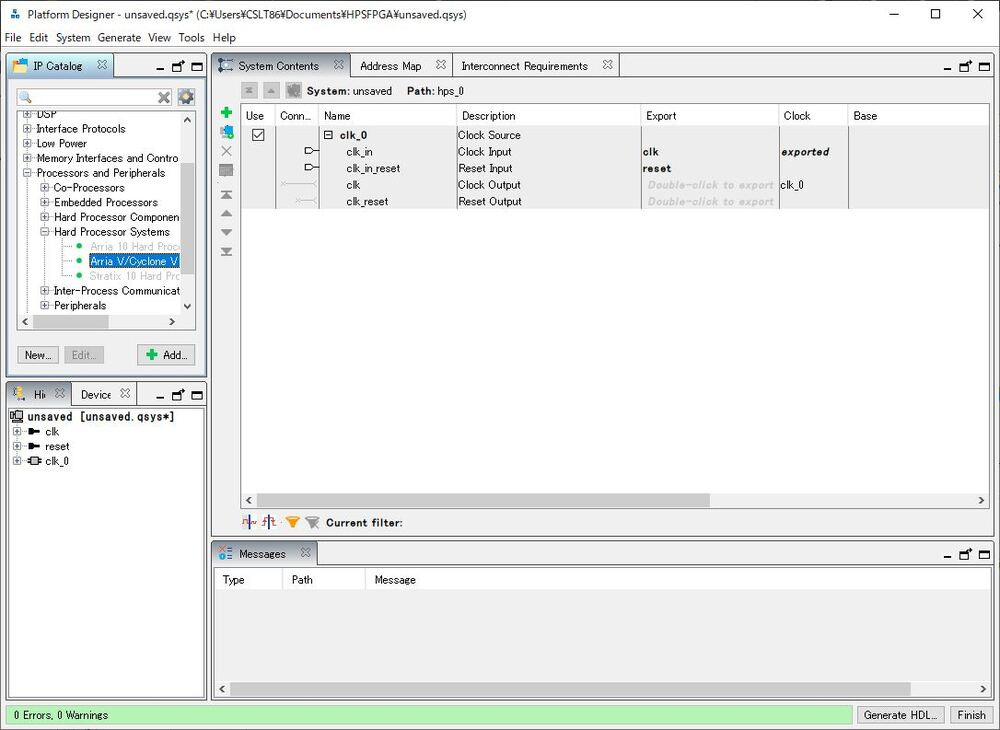
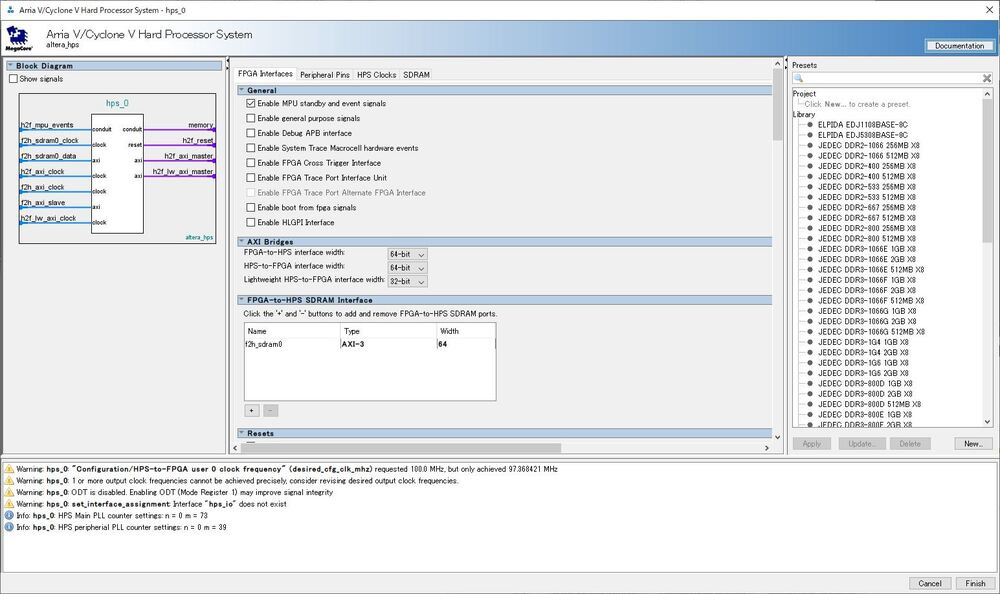
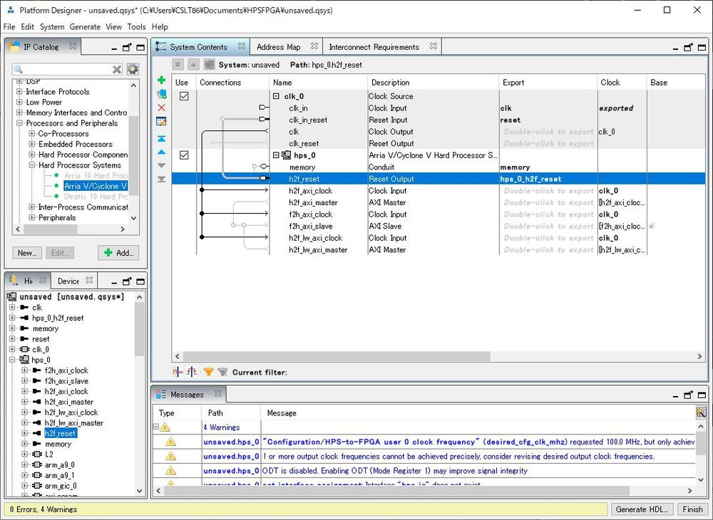
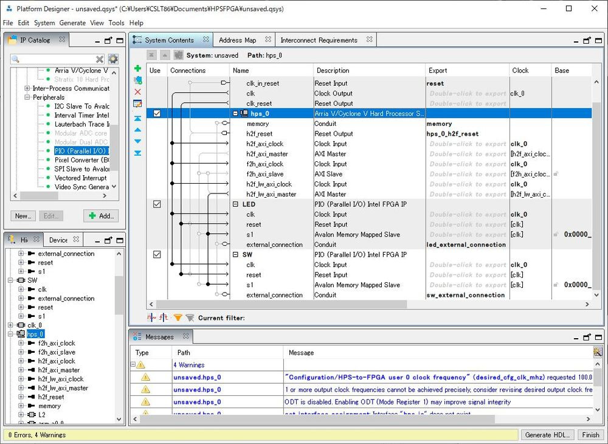

# How to Configure HPS on DE1-SoC

## 1. Create HPS Configurations



### 1.1. Open `Qsys` or `Platform Designer`.

### 1.2. Select `Hard Processor Systems` > `Cyclone V`.



### 1.3. Select `Disable MPU standby and event signals`.

### 1.4. Delete `FPGA-HPS SDRAM Interface`

### 1.5. Close the `hps_0` window.



### 1.6. Configure the bridge by clicking the junction.

### 1.7. Export `h2f_reset` of `hps_0`.



### 1.8. Create HPS and FPGA Connection.
- Add `PIO (Parallel I/O)`

### 1.9. Edit parameters and peripheral pins.
- Ethernet Media Access Controller
  - EMAC1 pin: HPS I/O Set 0
  - EMAC1 mode: RGMII
- SD/MMC Controller
  - SDIO pin: HPS I/O Set 0
  - SDIO mode: 4-bit Data
- USB Controllers
  - USB1 pin: HPS I/O Set 0
  - USB1 PHY interface mode: SDR with PHY clock output mode
- UART Controllers
  - UART0 pin: HPS I/O Set 0
  - UART0 mode: No Flow Control

### 1.10. Edit Parameters / SDRAM
- PHY Settings
  - Clocks
    - Memory clock frequency: 400 MHz
    - PLL reference clock frequency: 25 MHz
- Memory Parameters
  - Memory device speed grade: 800.0 MHz
  - Total interface width: 32
  - Row adress width: 15
  - Column address width: 10
  - Memory Initialization Options
    - Memory CAS latency setting: 11
    - Output drive strength setting; RZQ/7
    - ODT Rit normal value: RZQ/4
    - Memory write CAS latency setting: 8
- Memory Timing
  - tIS (base): 180 ps
  - tIH (base): 140 ps
  - tDS (base): 30 ps
  - tDH (base): 65 ps
  - tDQSQ: 125 ps
  - tQH: 0.38 cycles
  - tDQSCK: 255 ps
  - tDQSS: 0.25 cycles
  - tDQSH: 0.4 cycles
  - tDSH: 0.2 cycles
  - tDSS: 0.2 cycles
  - tINIT: 500 us
  - tMRD: 4 cycles
  - tRAS: 35.0 ns
  - tRCD: 13.75 ns
  - tRP: 13.75 ns
  - tREFI: 7.8 us
  - tRFC: 260 ns
  - tWR: 15.0 ns
  - tWTR: 4 cycles
  - tFAW: 30.0 ns
  - tRRD: 7.5 ns
  - tRTP: 7.5 ns
- Board Settings
  - Board Skews
    - Maximum CK delay to DIMM/device: 0.03 ns
    - Maximum DQS delay to DIMM/device: 0.02 ns
    - Minimum delay difference between CK and DQS: 0.09 ns
    - Maximum delay difference between CK and DQS: 0.16 ns
    - Maximum skew within DQS group: 0.01 ns
    - Maximum skew between DQS group: 0.08 ns
    - Maximum skew within address and command bus: 0.03 ns

## 2. Import HPS Configurations into Quartus Project

### 2.1. Open `qsys` or `Platform Designer`.

### 2.2. Click `Generate VHDL`.

### 2.3. Add `.qip` files to the quartus project.

### 2.4. Run `Processing` > `Start` > `Start Analysis & Synthesis`.

### 2.5. Run TCL scripts.
- `Tools` > `TCL Scripts` > `hps_sdram_p0_parameters.tcl`
- `Tools` > `TCL Scripts` > `hps_sdram_p0_pin_assignments.tcl`

### 2.6. Compile the Project.

## 3. When "child process exited abnormally" error occurred

### 3.1. Install WSL

```
wsl.exe --install Ubuntu
```

### 3.2. Install Eclipse
- Download CDT from https://www.intel.com/content/www/us/en/support/programmable/articles/000086893.html
- Unzip and move Quartus Installed Directory.
- Rename `eclipse` to `eclipse_nios2`.
- Unzip `eclipse_nios2_plugins.zip` and partially overwrite `eclipse_nios2`.

## Reference

- https://www.youtube.com/watch?v=2WUkEt4-Q7Q

