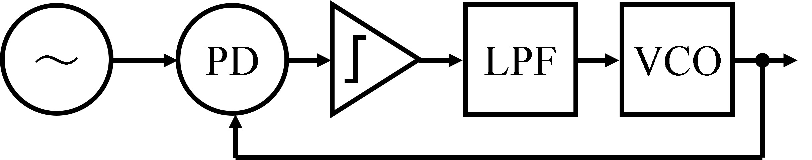

# Phase-Locked Loop (PLL)

## 1. What is a PLL
A Phase-Locked Loop (PLL) is a feedback control system that automatically adjusts the phase of a local oscillator to match the phase of an input signal.
It locks the phase of an output signal to a reference signal.

## 2. Main components

### 1. Phase Detector (PD)
Compare the phase of the input and the VCO output.
 
### 2. Low-Pass Filter (LPF)
Filters the output of the PD to remove high-frequency noise.

### 3. Voltage-Controlled Oscillator (VCO)
Generates an output whose frequency is controlled by the voltage from the LPF.

### 4. Frequency Divider
Implemented in feedback path to allow frequency multiplication or division.

