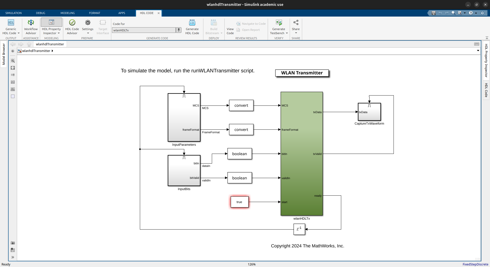

# Radiation Hardened Wireless LAN

## 1. Open IEEE 802.11 Sample Project of MATLAB / Simulink
### 1.1. Import WLAN HDL Transmitter Example
```
openExample('whdl/WLANHDLTransmitterExample', 'workDir', '~/WLANHDLTransmitter')
```

### 1.2. Import WLAN HDL Receiver Example
```
openExample('whdl/WLANHDLReceiverExample', 'workDir', '~/WLANHDLReceiver')
```

## 2. Project Parameters for IEEE 802.11n Compatibility

<div align="center">
  <table>
    <tr><td>Parameter Description</td><td>Parameter Name</td><td>Value Candidate</td><td>Selected Value</td></tr>
    <tr><td>Channel Bandwidth</td><td>cfgHT.ChannelBandwidth</td><td>CBW20 / CBW40 (20 MHz / 40 MHz)</td><td>CBW20 (forced)</td></tr>
    <tr><td>MCS (Modulation and Coding Scheme)</td><td>cfgHT.MCS</td><td>MCS0–MCS31</td><td>MCS7 (64-QAM)</td></tr>
    <tr><td>Number of Transmit Antennas</td><td>cfgHT.NumTransmitAntennas</td><td>1 -</td><td>1 (forced)</td></tr>
    <tr><td>Spatial Streams (MIMO)</td><td>cfgHT.NumSpaceTimeStreams</td><td>1 - 4</td><td>1 (forced)</td></tr>
  </table>
</div>

```
% The |runWLANTransmitter| script demonstrates the |wlanhdlTransmitter| Simulink(R) model by
%  performing these steps:
%  1. Set WLAN transmitter parameter configuration.
%  2. Generate input for the model.
%  3. Compare Simulink output with MATLAB |wlanWaveformGenerator| function output.

%   Copyright 2024 The MathWorks, Inc.

%% WLAN HDL Transmitter Input Data Generation
numOfPackets = 1; % number of packets 
frameFormatIndex = 1; % 0 --> 'Non-HT', 1 --> 'HT-MF', 2 --> 'VHT'
MCS = 7; % 0 to 7
...
```

## 3. Generate Hardware Description Language (HDL)
### 3.1. Run the Project on MATLAB

### 3.2. Click `Generate HDL Code` on Simulink Top-Level
<div align="center"></div>

### 3.3. Generated Top-Level Entity
```VHDL
ENTITY wlanHDLTx IS
  PORT( clk                               :   IN    std_logic;
        reset                             :   IN    std_logic;
        clk_enable                        :   IN    std_logic;
        MCS                               :   IN    std_logic_vector(2 DOWNTO 0);  -- ufix3
        frameFormat                       :   IN    std_logic_vector(1 DOWNTO 0);  -- ufix2
        bitIn                             :   IN    std_logic;
        validIn                           :   IN    std_logic;
        start                             :   IN    std_logic;
        ce_out_0                          :   OUT   std_logic;
        ce_out_1                          :   OUT   std_logic;
        txData_re                         :   OUT   std_logic_vector(31 DOWNTO 0);  -- sfix32_En24
        txData_im                         :   OUT   std_logic_vector(31 DOWNTO 0);  -- sfix32_En24
        txValid                           :   OUT   std_logic;
        ready                             :   OUT   std_logic
        );
END wlanHDLTx;
```

<div align="center">
  <table>
    <tr><td>Port Name</td><td>Description</td><td>Value</td></tr>
    <tr><td>clk</td><td>Clock</td><td></td></tr>
    <tr><td>reset</td><td>Reset</td><td></td></tr>
    <tr><td>clk_enable</td><td>Clock Enable</td><td></td></tr>
    <tr><td>MCS</td><td>Modulation and Coding Scheme</td><td>"111"</td></tr>
    <tr><td>frameFormat</td><td>Non-HT ["00"], HT-MF ["01"], VHT ["10"]</td><td>"01"</td></tr>
    <tr><td>bitIn</td><td>Input payload data of PSDU length bytes</td><td></td></tr>
    <tr><td>validIn</td><td>Valid signal for the input data</td><td></td></tr>
    <tr><td>start</td><td>Start signal to start the WLAN packet transmission</td><td></td></tr>
    <tr><td>ce_out_0</td><td></td><td></td></tr>
    <tr><td>ce_out_1</td><td></td><td></td></tr>
    <tr><td>txData_re</td><td>Real part of DAC input sampled at 20 Msps</td><td></td></tr>
    <tr><td>txData_im</td><td>Imaginary part of DAC input sampled at 20 Msps</td><td></td></tr>
    <tr><td>txValid</td><td>Control signal that validates the transmitter output sampled at 20 Msps</td><td></td></tr>
    <tr><td>ready</td><td>Control signal that indicates when to sample the input payload, MCS, and frame format input values</td><td></td></tr>
  </table>
</div>

## 4. The Generated HDL are Implemented into RF-SoC
### 4.1. IEEE 802.11n Specifications

<div align="center">
  <table>
    <tr><td>Item</td><td>Value</td></tr>
    <tr><td>Required Clock Freq.</td><td>160 MHz</td></tr>
    <tr><td>ADC Type</td><td>SAR ADC</td></tr>
  </table>
</div>
